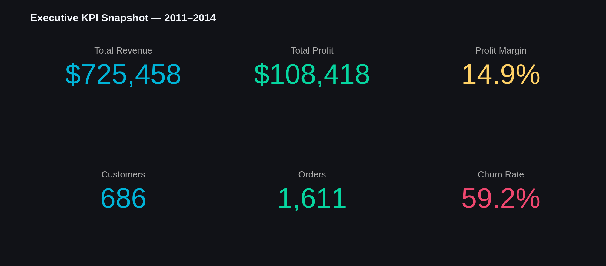
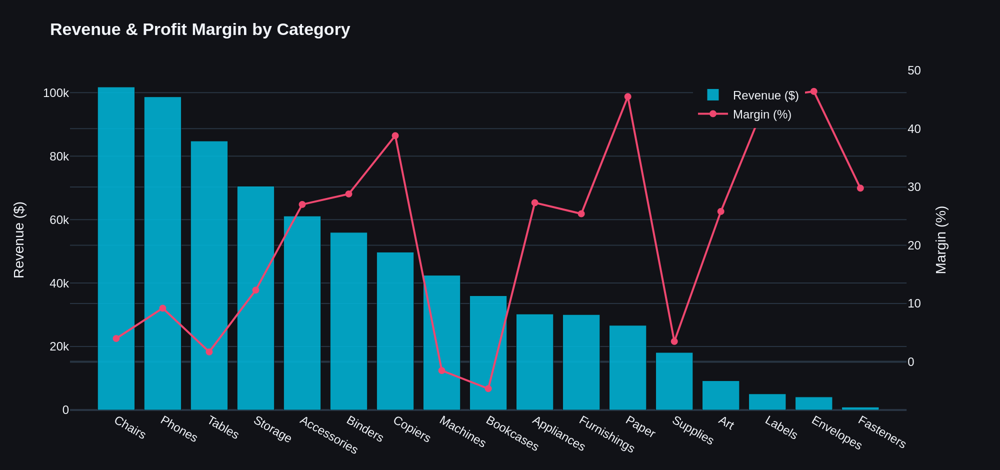
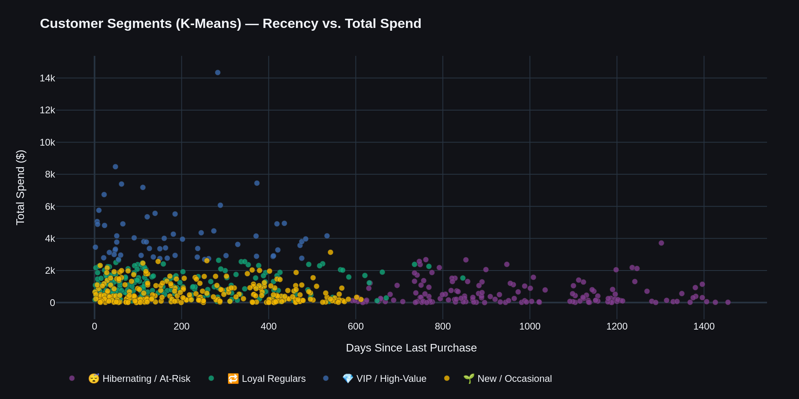
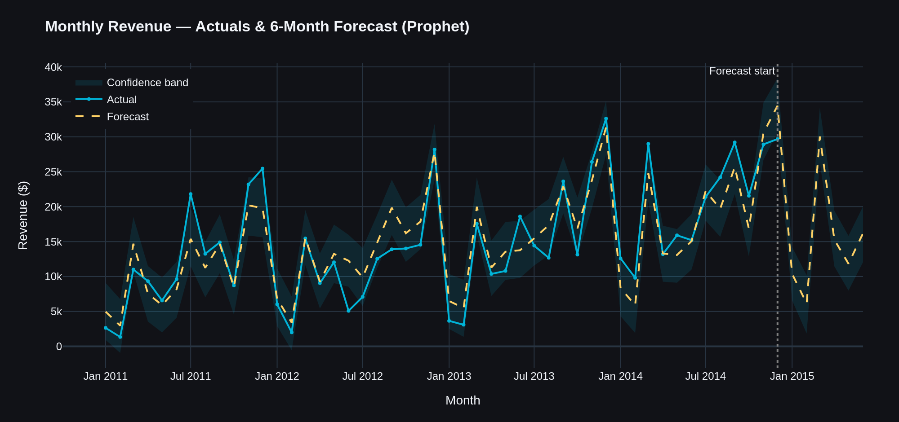
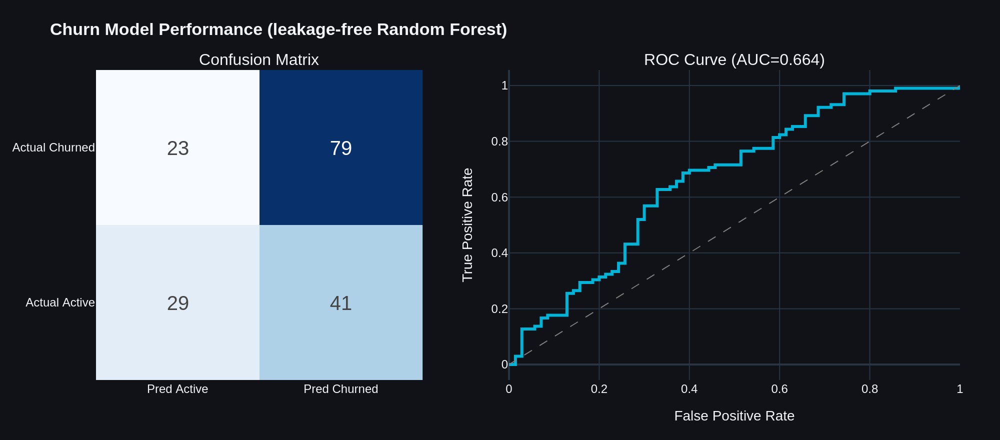
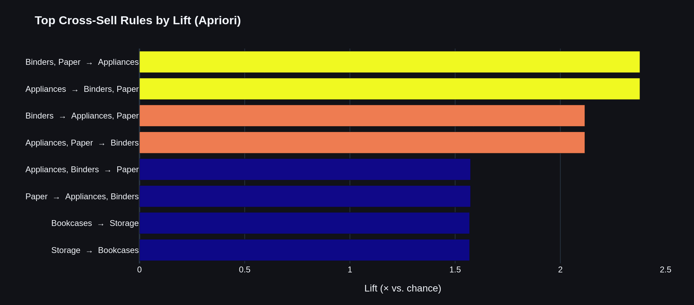

# 📦 End-to-End E-Commerce Sales Analysis

A four-notebook analytics pipeline that takes raw retail order data from cleaning all
the way to a costed, prioritised set of business recommendations — covering EDA, feature
engineering, four machine-learning models, and an executive insights report.

> **Business question:** *Which products, customers, and regions drive revenue — and where
> are we silently losing money or about to lose customers?*



---

## 🔑 Key Findings

| Area | Insight |
|---|---|
| 💰 Revenue | **\$725K** revenue · **\$108K** profit · **14.9%** margin across 3,203 line items / 1,611 orders (2011–2014) |
| 📉 Leakage | **9.9%** of line items are sold at a loss — recoverable margin through repricing |
| 💎 Customers | A **VIP cluster of 59 customers (9% of base) drives ~35% of all revenue** (\$251K) |
| ⚠️ Churn | **59% historical churn**; 96 *active* customers flagged high-risk (\~\$74K of revenue) |
| 🛒 Cross-sell | Buyers of *Binders + Paper* are **2.4× more likely** to buy *Appliances* |
| 📈 Forecast | Prophet projects \~**\$90K** revenue over the next 6 months (≈26% backtest MAPE) |

---

## 🗂️ Pipeline

| Notebook | Stage | What it does |
|---|---|---|
| [`01_EDA_and_Data_Cleaning.ipynb`](01_EDA_and_Data_Cleaning.ipynb) | Clean & explore | Validation, feature engineering, 6 business-question EDA charts |
| [`02_Feature_Engineering_RFM.ipynb`](02_Feature_Engineering_RFM.ipynb) | Feature build | RFM scoring, churn labelling, customer-level ML table |
| [`03_ML_Models.ipynb`](03_ML_Models.ipynb) | Modelling | K-Means segmentation · Prophet forecast · Random Forest churn · Apriori associations |
| [`04_Insights_Report.ipynb`](04_Insights_Report.ipynb) | Synthesise | Executive KPI dashboard + prioritised, costed recommendations |

Each notebook reads the previous notebook's output, so **run them in order**.

---

## 📊 Visual Highlights

**Revenue is concentrated in a few categories — and ~10% of items sell at a loss.**



**K-Means surfaces four natural customer segments. A small VIP group anchors revenue; a long hibernating tail is already gone.**



**Prophet forecasts the next six months from the 2011–2014 trend and seasonality.**



**The churn model is deliberately leakage-free (recency excluded) — an honest ROC-AUC ≈ 0.66, not a cosmetic 1.0.**



**Market-basket analysis reveals which category pairings to cross-sell.**



---

## 🧰 Tech Stack

`Python` · `pandas` · `numpy` · `scikit-learn` · `Prophet` · `mlxtend` · `Plotly`

---

## ▶️ How to Run

```bash
# 1. Clone
git clone https://github.com/<your-username>/ecommerce-sales-analysis.git
cd ecommerce-sales-analysis

# 2. (Recommended) create a virtual environment
python -m venv .venv
source .venv/bin/activate          # Windows: .venv\Scripts\activate

# 3. Install dependencies
pip install -r requirements.txt

# 4. Launch Jupyter and run notebooks 01 -> 04 in order
jupyter lab
```

The notebooks expect the raw data at `data/raw/Amazon_2_Raw.xlsx` and create
`data/processed/` and `models/` as they run.

> **Note on charts:** the notebooks use **Plotly**, which GitHub's notebook preview does not
> render. The static PNGs above (in [`reports/figures/`](reports/figures/)) are exported from
> the notebooks; to explore the *interactive* versions, open any notebook through
> **[nbviewer](https://nbviewer.org/)** or run it locally.

---

## 📁 Repository Structure

```
ecommerce-sales-analysis/
├── 01_EDA_and_Data_Cleaning.ipynb
├── 02_Feature_Engineering_RFM.ipynb
├── 03_ML_Models.ipynb
├── 04_Insights_Report.ipynb
├── data/
│   ├── raw/            # source data (committed)
│   └── processed/      # generated by the notebooks (git-ignored)
├── models/             # trained models, generated (git-ignored)
├── reports/
│   └── figures/        # exported PNG charts (committed — used in this README)
├── requirements.txt
├── .gitignore
└── README.md
```

---

## ⚖️ Methodology Notes (the honest bits)

- **No target leakage in churn:** the churn label is defined from recency, so the Random Forest
  *excludes* all recency-derived features. The result is an honest ROC-AUC ≈ 0.66 rather than a
  cosmetic 1.0 — and the takeaway that recency is the dominant churn signal.
- **Forecast ships with error:** the Prophet forecast is backtested (≈26% MAPE); treat the
  confidence band, not the point estimate, as the plan.
- **Recommendation impacts are illustrative,** computed from explicit, editable assumptions in
  Notebook 04 — sized to prioritise, not to forecast precisely.
- Data spans 2011–2014; all figures are historical.

---
